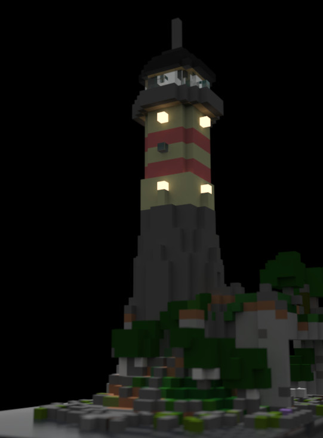

# we2vox

Convert from Minetest Worldedit .we to MagicaVoxel .vox .
The script tries to take colors from colors.txt, uses grey if not listed. MagicaVoxel is limited to 256 colors/materials, so areas that have more different nodes can't be converted.

`./we2vox.py infile.we [outfile.vox]`

